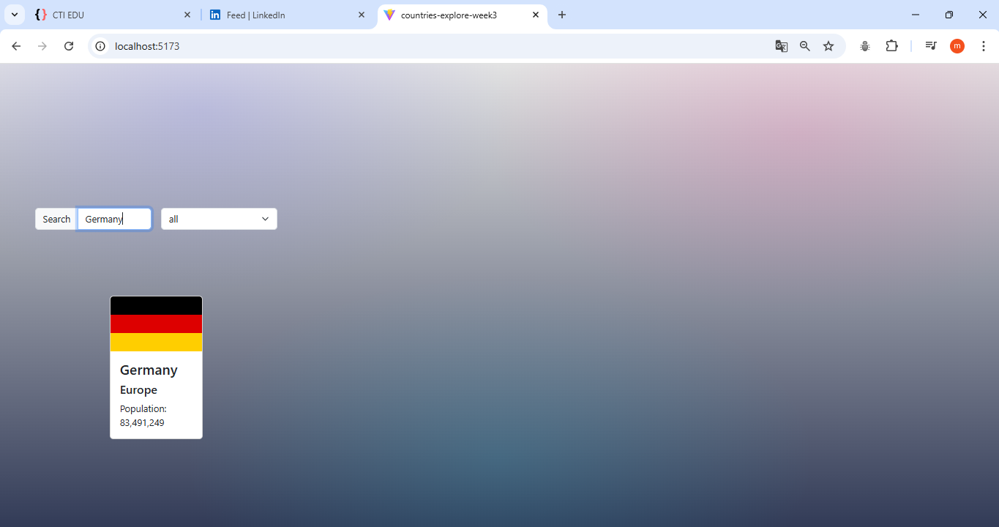

# countries-explore-week3

A React application to explore countries around the world using the **REST Countries** API.  
Users can search by country name, filter by region, and view detailed information like the flag, population, and region. 

## features
- Search countries by name
- Filter countries by region (All, Africa, Asia, Americas, Europe, Oceania)
- Responsive layout with Bootstrap 5
- Display country cards with:
  - Flag
  - Name
  - Region
  - Population
- Proper handling of:
  - Loading state
  - Errors (e.g., country not found, fetch errors)
  - Empty search results
- Clean and reusable React components:
  - `SearchBar`
  - `Card`

## How to run the project
Follow these steps to run the project locally:

1. Make sure have **Node.js(v16 or later)** installed.
2. git 	[clone](https://github.com/masouma-2025/countries-explore-week3.git) cd countries-explore-week3
3. Install dependencies by npm install
4. start the development server by npm start
5. open your browser and go to http:/localhost:5120

## API Endpoints used
- GET /v3.1/all  
  Fetches all countries
- GET /v3.1/name/{name}  
  Fetches countries by name search
-  GET /v3.1/region/{region}  
  Fetches countries by selected region  

